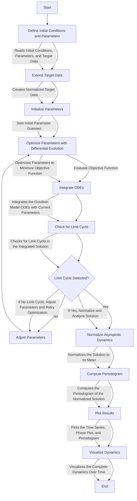

# Goodwin Model Simulation

This project simulates the Goodwin model, a simplified circadian rhythm model.

## Project Structure

- `goodwin_model/`: Main package containing model definition, integration, analysis, and plotting modules.
- `tests/`: Directory for unit tests.
- `config.yaml`: Configuration file for model parameters.
- `main.py`: Main script to run the simulation.
- `requirements.txt`: File listing dependencies.

## Usage

1. Install dependencies:
    ```
    pip install -r requirements.txt
    ```

2. Run the simulation:
    ```
    python main.py
    ```

## Configuration

Modify `config.yaml` to change the model parameters.


## Model details

$$
\frac{dX}{dt} = \nu_1 (\frac{K_1^{hill}}{K_1^{hill} + Z^{hill} + S^{hill} + W^{hill}}) (b + cX +dW) - \nu_2(\frac{X}{K_2+X})
$$

X = CLK/BMAL (e-box activity)
Y = PER/tr-CRY mRNA
Z = PER/tr-CRY proteins (inhibitor complex)
S = REV-ERB protein
W = CWO protein
b = basal CLK/BMAL activation
dW = positive effect of CWO

- $\nu_1$ is the maximum transcription rate of BMAL/CLK (X)
- $\frac{K_1^{hill}}{K_1^{hill} + Z^{hill} + S^{hill} + W^{hill}}$ represents competitive inhibition of X by PER/CRY (Z), REV-ERB (S), and CWO (W) proteins binding to E-boxes/ROR elements
- $K_1$ is the inhibition constant
- $hill$ is the Hill coefficient representing cooperativity
- $(1 + cX)$ models the positive feedback loop on X by PDP1, where c is the strength of the feedback

$$
\frac{dY}{dt} = \nu_3X (\frac{K_3^{hill}}{K_3^{hill} + W^{hill}}) - \nu_4\frac{Y}{K_4+Y}
$$

- $\nu_3$ is the maximum transcription rate of PER/CRY (Y) by X
- $\frac{K_3^{hill}}{K_3^{hill} + W^{hill}}$ represents competitive inhibition of Y transcription by CWO (W)

$$
\frac{dZ}{dt} = \nu_5Y - \nu_6\frac{Z}{K_6+Z}
$$
 
 - $\nu_5$ is the translation rate of Z from Y
- $\nu_6$ is the maximum degradation rate of Z
- $\frac{Z}{K_6+Z}$ is a Michaelis-Menten term for Z degradation

$$
\frac{dR}{dt} = \nu_7X - \nu_8\frac{R}{K_7+R}
$$
$$
\frac{dS}{dt} = \nu_9R - \nu_10 \frac{S}{K_8+S}
$$


# Workflow to optimize model parameters




